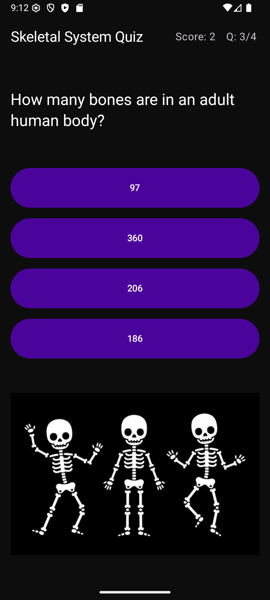

# Skeletal System Quiz App

created by Joshua Kuschner

jkuschner@csu.fullerton.edu

CWID: 861466472

---

This quiz app tests your knowledge of the human skeletal system. You start out at the home screen where you are greeted and may start the quiz. Select an answer to each question to progress through the quiz. At the end, your results will be displayed and you may try again if you'd like. Have fun!

---

## Home Screen

## Quiz Screen

### First Question

### Second Question

### Third Question

### Fourth Question

## Results Screen

